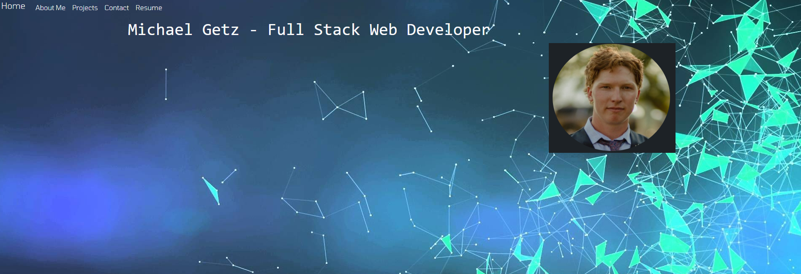

# Portfolio 2.0

## License

## Table of Contents:

- [Description](#description)
- [Usage](#usage)
- [How to Contribute](#contribute)
- [Tests](#tests)
- [Questions](#questions)
- [Portfolio](#portfolio)

## Description

This portfolio was built using React. This is a refurbished verion of my original portfolio project built with standard html and css. This application is still under development. Tips and feedback are appreciated!

## Usage

## How to Contribute

I am always open to feedback. If you have the time and inclination, shoot me an email or look me up on LinkedIn! Thanks!

## Tests

TBD

## Questions

For any questions, please view my profile at: https://github.com/mgetz34
My email address is: mgetz340@gmail.com
Li: https://www.linkedin.com/in/michael-getz-340/

## Portfolio

https://mgetz34.github.io/portfolio2.0/
